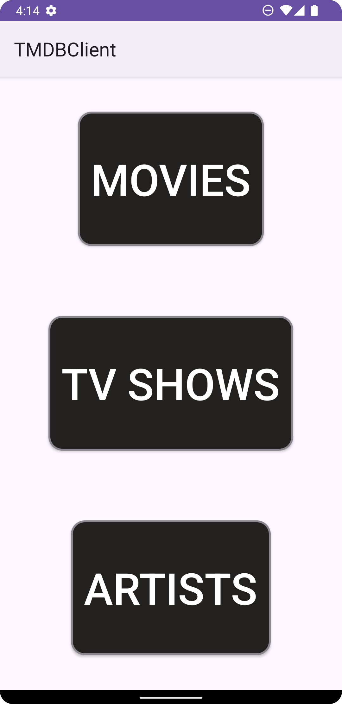

# TMDB Movie Explorer

TMDB Movie Explorer is an Android application that allows users to browse popular movies, TV shows, and artists using the TMDB (The Movie Database) API. The app showcases a clean and modern user interface with offline caching and data persistence.

## Features

- **Browse Popular Content**:
    - 🎬 Movies ([Preview](app/Screenshots/Movies.png))
    - 📺 TV Shows ([Preview](app/Screenshots/TvShow.png))
    - 🌟 Artists ([Preview](app/Screenshots/Artists.png))

- **Offline Support**: Cache data locally using Room database
- **Search Functionality**: Find movies, TV shows, or artists quickly
- **Modern UI**: Clean, intuitive interface with smooth animations
- **MVVM Clean Architecture**: Better separation of concerns and easier testing

## Technologies Used

- **Language**: Kotlin
- **Architecture**: MVVM Clean Architecture
- **Android Jetpack**:
    - LiveData
    - ViewModel
    - Room Database
- **Libraries**:
    - Retrofit - Networking
    - Glide - Image loading
    - Dagger - Dependency injection
    - Coroutines - Asynchronous programming
